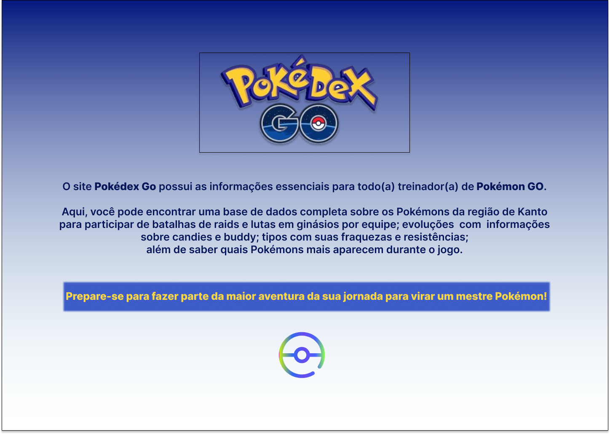
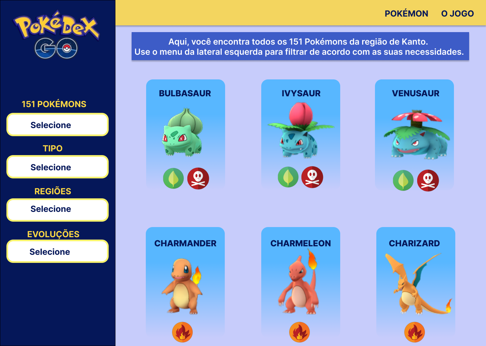
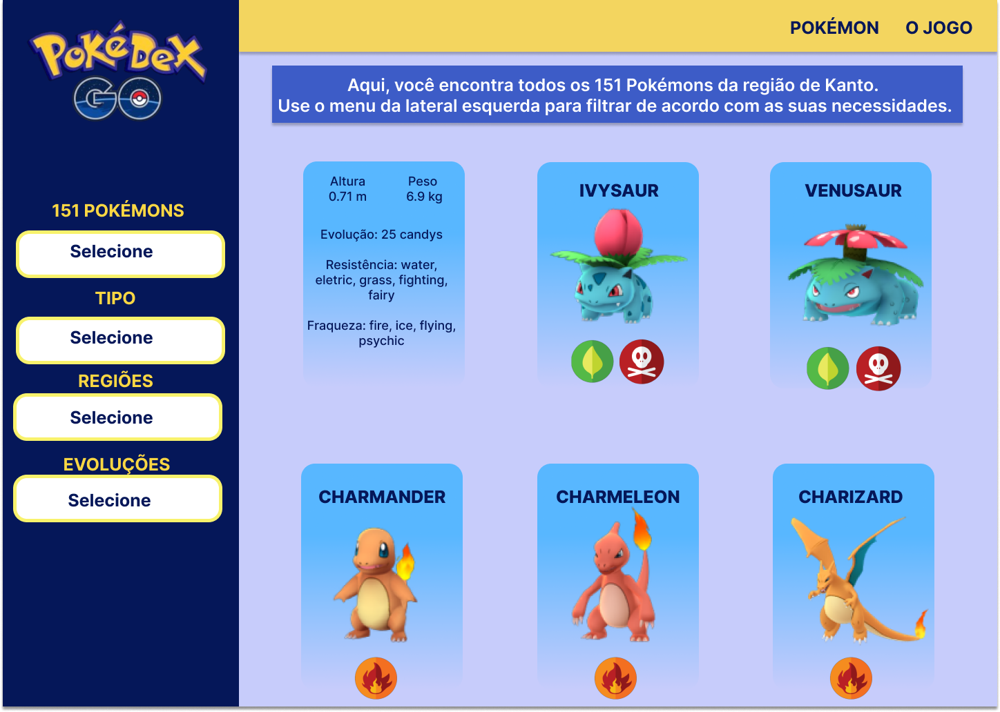
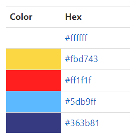
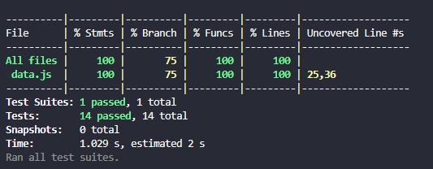
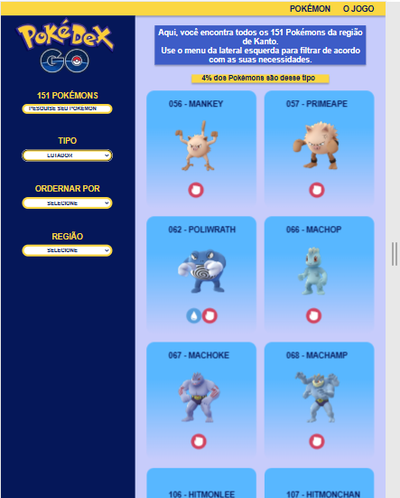
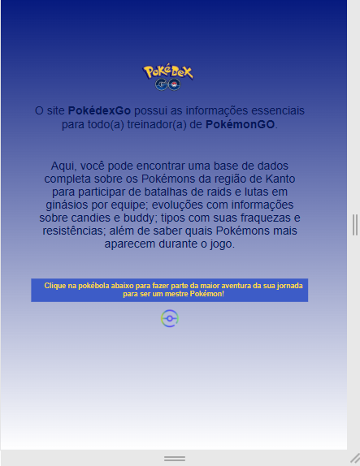

# Data Lovers

## Índice

* [1. Resumo do projeto](#1-resumo-do-projeto)
* [2. Objetivos de aprendizagem](#2-objetivos-de-aprendizagem)
* [3. Protótipos](#3-protótipos)
* [4. Detalhamentos do projeto](#4-detalhamentos-do-projeto)
* [5. Testes de usabilidade](#5-testes-de-usabilidade)
* [6. Deploy](#6-deploy)
* [7. Desenvolvedoras](#7-desenvolvedoras)

***

## 1. Resumo do projeto 💡  

O projeto Data Lovers tem como objetivo a manipulação de um banco de dados, fornecido pela Laboratoria, por meio de filtragem, ordenação e cálculo agregado. Este é o segundo projeto obrigatório como parte formatória do curso de Front-End da turma SAP009 da Laboratoria.

O tema escolhido foi o jogo PokémonGo, na qual tivemos que mapear, manipular dados e apresentá-los em uma página web, nomeada PokédexGo, de acordo com as necessidades apresentadas em histórias de usuários. O site é destinado para fãs e jogadores do jogo pudessem ter acesso a diversas informações e realizar pesquisas.

Foram criadas três histórias de usuários que nortearam o projeto:

**História de usuário 1 -** Eu, como jogador de Pokémon Go, quero ter uma lista dos Pokémons com suas principais características para saber quais Pokémons estão no jogo.

**História de usuário 2 -** Eu, como jogador de Pokémon Go, quero saber quais Pokémons evoluem para saber quantos candies são necessários para eles evoluírem.

**História de usuário 3 -** Eu, como treinador Pokémon Go, quero saber quais são as fraquezas e as resistências de cada Pokémon para definir melhor minha equipe de batalha.

## 2. Objetivos de aprendizagem 📜

Os principais objetivos de aprendizagem que buscamos alcançar durante o projeto foram:

* [x] Usar VanillaJS.
* [x] Uso de Git e GitHub colaborativo.
* [x] Passa pelo linter (`npm run pretest`)
* [x] Passa pelos testes (`npm test`)
* [x] Testes unitários cobrem um mínimo de 70% de statements, functions, lines e
  branches.
* [x] Inclui uma _definição de produto_ clara e informativa no `README.md`.
* [x] Inclui histórias de usuário no `README.md`.
* [x] Inclui rascunho da solução (protótipo de baixa fidelidade) no `README.md`.
* [x] Inclui protótipo de alta fidelidade no `README.md`.
* [x] Inclui uma lista de problemas detectados nos testes de usabilidade no
  `README.md`.
* [x] UI: Mostra lista/tabela/etc com dados e/ou indicadores.
* [x] UI: Permite ordenar dados por um ou mais campos (asc e desc).
* [x] UI: Permite filtrar dados com base em uma condição.
* [x] UI: É _responsivo_.

## 3. Protótipos :pencil2:

### Protótipo de baixa fidelidade

Cada membro da equipe foi responsável em rascunhar um protótipo de baixa fidelidade, assim apresentaríamos mais ideias e conseguiríamos criar um projeto que atendesse melhor às necessidades dos usuários.

### Protótipo de alta fidelidade

O protótipo de alta fidelidade foi criado no Figma.

## 4. Detalhamentos do projeto ⚙️

O projeto final contou com:

### Página de abertura

O usuário recebe uma breve explicação do jogo e é convidado a entrar no site para ter acesso às informações.

### Página principal

Os cards dos Pokémons são mostrados em tela e com a estilização flip do CSS, as informações como candies, altura, peso, resistências e fraquezas sobre aquele Pokémon são mostradas no verso.

No menu lateral, é possível filtrar os Pokémons de acordo com nome, tipo, região, além de ordenação alfabética ou numérica, ambos crescente e decrescente. Há também um menu superior com dois links; o primeiro (*POKÉMON*) direciona para a página principal e o segundo (*O JOGO*), direciona para o site oficial do jogo PokémonGo.

Conforme o usuário desce a tela com os cards, foi inserido um botão que retorna para o topo.

### Paleta de cores

A paleta de cores utilizada para guiar o projeto foi:

### Testes unitários

Foram criados testes unitários para as funções de filtro, ordenação e cálculo agregado. Os testes tiveram 100% de aprovação.

## 5. Testes de usabilidade :bar_chart:

Foram realizados testes de usabilidade em diferentes navegadores (Chrome, Internet Explorer, Firefox e Opera). A página principal apresentou a responsividade esperada em todos os navegadores, assim como sua usabilidade.

Já a página de abertura apresentou leve desconfiguração na responsividade, conforme imagem abaixo:

## 6. Deploy 🖥️

COLOCAR LINK

## 7. Desenvolvedoras 👩‍💻

Giselle Schwab Silva [ LinkedIn](https://www.linkedin.com/in/giselle-schwab-silva-58930610a/)
&nbsp;
[ GitHub](https://github.com/giselleschwab)

Marina Cezário Guimarães Pereira [ LinkedIn](https://www.linkedin.com/in/marina-cezario/)
&nbsp;
[ GitHub](https://github.com/marinacezario)
